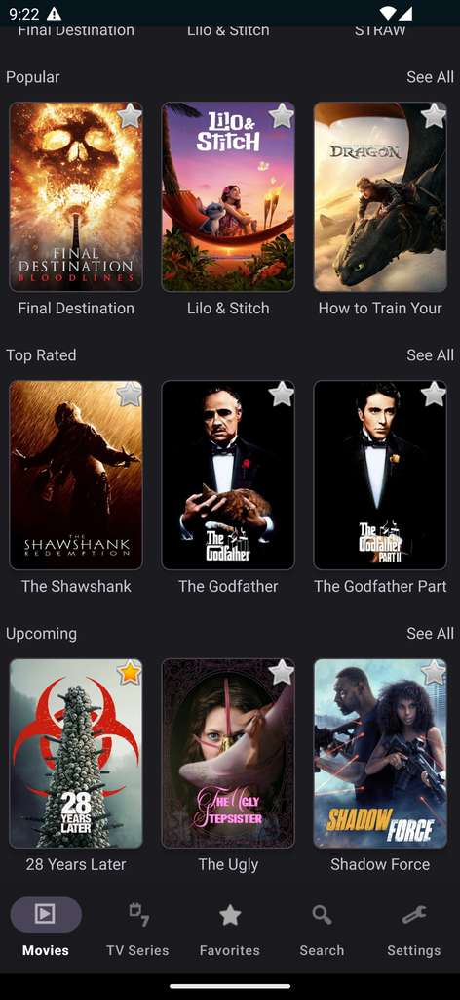
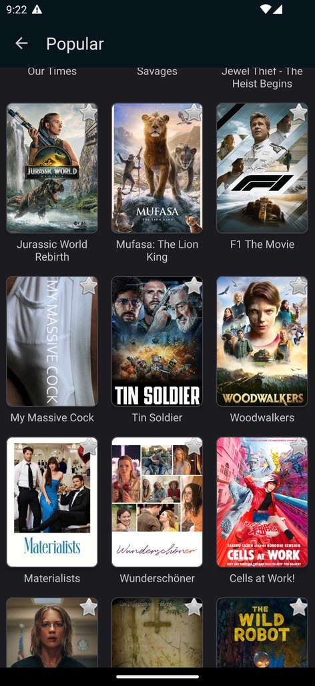
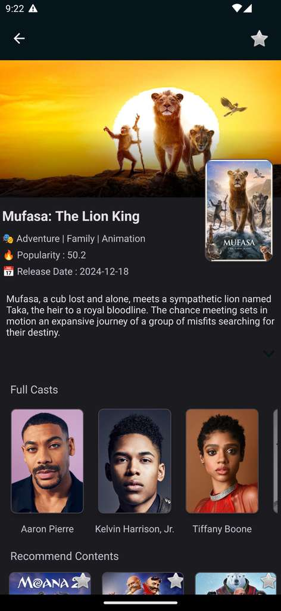
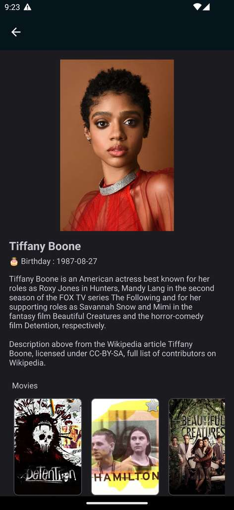
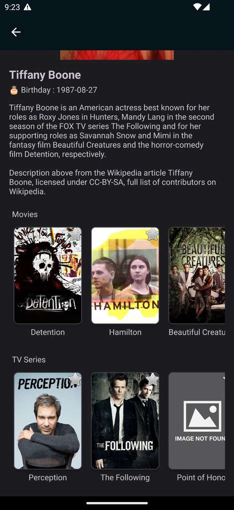
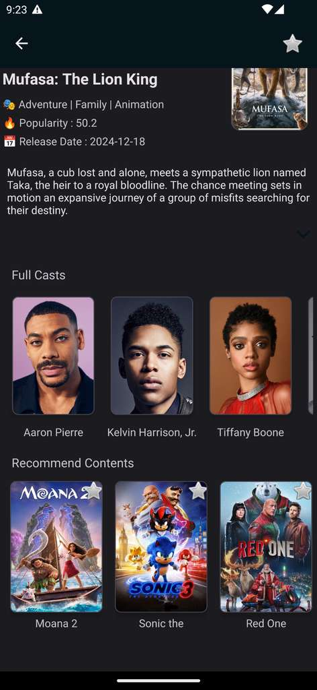
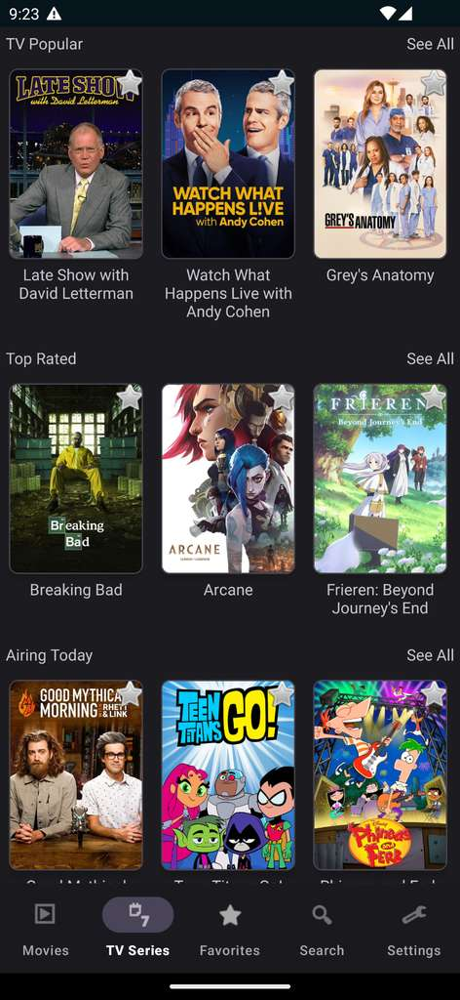
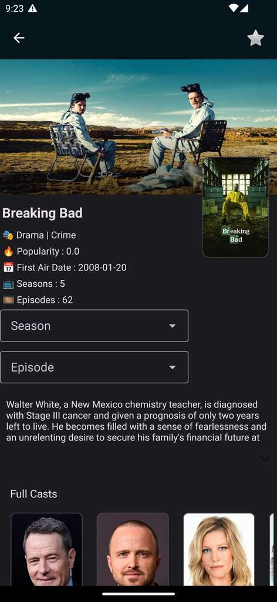
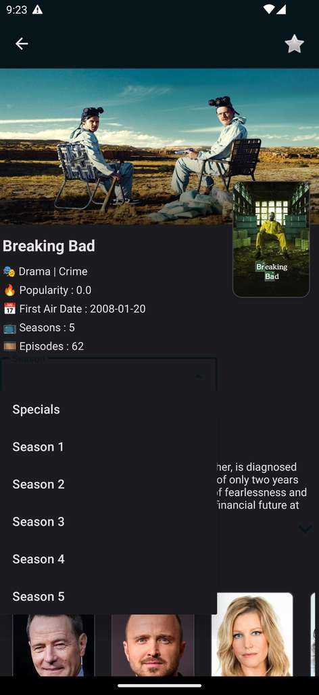
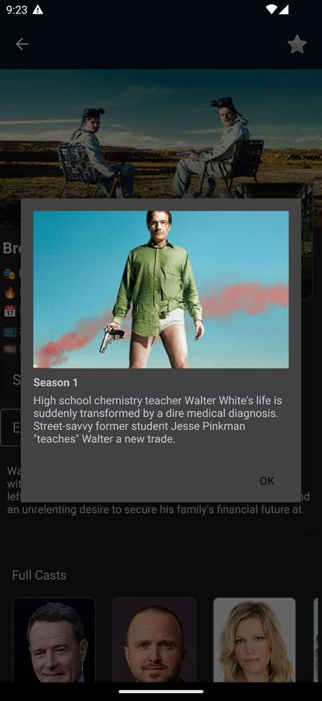

# MovieDB 🎬 🌺

MovieDB is an Android showcase app built around **The Movie Database (TMDb)** API. Browse movies and TV series, search, and view detailed pages.


## Features 📊

MovieDB demonstrates a typical **MVVM** Android application. Below are some of
the libraries and components used in the project.

- 🔗 **Retrofit** with **RxJava3**, Moshi and OkHttp for networking
- 💻 **Dagger 2** for dependency injection
- 📺 **RecyclerView** based screens for movies and TV shows
- 🎬 **Search** and detailed pages with cast, seasons and episodes
- ❤️ **Favorites** stored locally
- 🌗 **Dark mode** and multiple **language** support
- 💡 **ExpandableTextView** for long descriptions
- 📷 **Picasso** and **Glide** for image loading
- 💥 Material Components

## Technologies Used 🛠

This project is written in **Kotlin** and uses **AndroidX** libraries. Core
dependencies include Dagger 2 for dependency injection, Retrofit with OkHttp and
Moshi for network requests, and RxJava3 for reactive operations. Images are
loaded with Picasso and Glide while Timber is used for logging.

## Screenshots 📸

Below are sample screens from the application. Each image is scaled to 300&nbsp;px
wide for readability.

### Home Screen
Shows trending movies and TV series.



### Movie Detail
Detailed view with cast and overview information.



### Search Results
Quickly find movies and shows.



### TV Series Listing
Browse popular and top rated series.



### TV Series Detail
Episode and season information.



### Cast Details
See actor biography and credits.



### Favorites
Your saved movies and series.



### Settings
Dark mode and language options.



### Episode Listing
Season episodes and air dates.



### Splash Screen
Startup animation.



## Donation 💰

If this project helps you, feel free to buy me a coffee!

[](https://www.buymeacoffee.com/halilozel1903)

## License ℹ️
```
MIT License

Copyright (c) 2023 Halil OZEL

Permission is hereby granted, free of charge, to any person obtaining a copy
of this software and associated documentation files (the "Software"), to deal
in the Software without restriction, including without limitation the rights
to use, copy, modify, merge, publish, distribute, sublicense, and/or sell
copies of the Software, and to permit persons to whom the Software is
furnished to do so, subject to the following conditions:

The above copyright notice and this permission notice shall be included in all
copies or substantial portions of the Software.

THE SOFTWARE IS PROVIDED "AS IS", WITHOUT WARRANTY OF ANY KIND, EXPRESS OR
IMPLIED, INCLUDING BUT NOT LIMITED TO THE WARRANTIES OF MERCHANTABILITY,
FITNESS FOR A PARTICULAR PURPOSE AND NONINFRINGEMENT. IN NO EVENT SHALL THE
AUTHORS OR COPYRIGHT HOLDERS BE LIABLE FOR ANY CLAIM, DAMAGES OR OTHER
LIABILITY, WHETHER IN AN ACTION OF CONTRACT, TORT OR OTHERWISE, ARISING FROM,
OUT OF OR IN CONNECTION WITH THE SOFTWARE OR THE USE OR OTHER DEALINGS IN THE
SOFTWARE.
```
